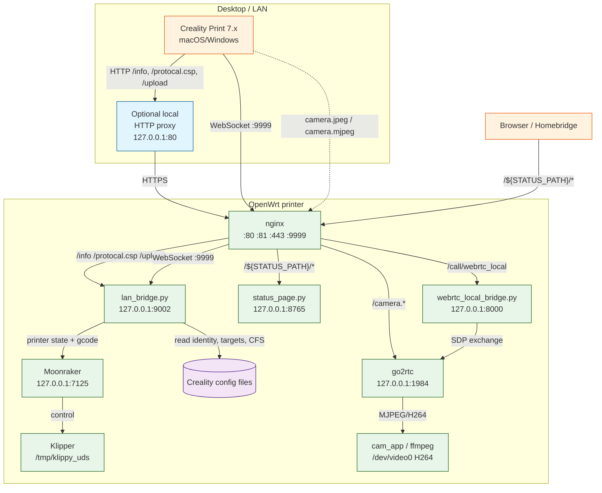

# Creality LAN Bridge — Architecture

This page describes how the printer, the compatibility backend, the desktop app, and the camera pipeline fit together.

## High-level topology



## Request flow examples

### 1. App asks “what is this printer?”

```text
App ──GET /info────► nginx ──► lan_bridge.py
lan_bridge.py reads system_config.json + keybox → returns model, SN, MAC, name
```

### 2. App sends LED toggle

```text
App ──ws:{lightSw:1}────► nginx:9999 ──► lan_bridge.py
lan_bridge.py ──SET_PIN PIN=LED VALUE=1.000──► Moonraker /printer/gcode/script
Moonraker ──► Klipper ──► LED turns on
lan_bridge.py re-reads output_pin LED and reports lightSw back
```

### 3. App starts a print

```text
App ──ws:{multiColorPrint:{gcode:"/path/to/file.gcode"}}──► lan_bridge.py
lan_bridge.py ──POST /printer/print/start {filename}──► Moonraker
```

### 4. App shows camera

```text
App ──GET /camera.jpeg────► nginx ──proxy──► go2rtc /api/frame.jpeg?src=camera
go2rtc grabs H264 frame from ffmpeg/v4l2 and serves a JPEG
```

## Component responsibilities

| Component | Responsibility |
|-----------|----------------|
| `nginx` | Terminates app-facing HTTP/WebSocket; routes to backend, camera, or status page; handles TLS on 443 if configured. |
| `lan_bridge.py` | Translates Creality LAN protocol to Moonraker/Klipper; pushes status over WebSocket; serves `/info`, `/protocal.csp`, `/upload`. |
| `go2rtc` | Reads `/dev/video0` H264 and exposes frame/stream endpoints on `:1984`. |
| `webrtc_local_bridge.py` | Optional adapter that turns go2rtc WebRTC answers into the base64 JSON the app expects for `POST /call/webrtc_local`. |
| `status_page.py` | Operational status dashboard, LED control, and TLS certificate info at `/${STATUS_PATH}/`. |
| `Moonraker` | Klipper API gateway and file manager. |
| `Klipper` | Real-time printer control. |

## State sources

`lan_bridge.py` merges several sources to build the status the app expects:

| Status field | Source |
|--------------|--------|
| Identity (model, SN, MAC, name) | `system_config.json` + `/usr/bin/keybox` |
| Temps, progress, state | Moonraker `/printer/objects/query` |
| Targets | `temperature_info.json` |
| Live XYZ, fan | `pipe-*.json` |
| CFS/AMS boxes | `material_box_info.json` |
| Files / history / timelapse | Moonraker files/list, history/list, `delay_image_info.json` |

## Configuration knobs

| Env var | Effect |
|---------|--------|
| `MOONRAKER_URL` | Where the backend calls Klipper state and G-code. |
| `PUBLIC_HOST` | Hostname used in `linuxVideoUrl` and info payloads. |
| `PUBLIC_SCHEME` | `http` or `https` for generated URLs. |
| `CFS_FLATTEN` | `0` = stock multi-box layout (drops empty boxes); `1` = flatten into one 8-slot box. |

## What is NOT in scope

- **Creality Cloud mobile camera**: the cloud mobile app streams through Creality's cloud tunnel, not the local network. This project only handles LAN.
- **mDNS auto-discovery**: the app scan page still needs work; add the printer by IP for now.
- **Modifying the desktop app bundle**: per project policy, the macOS Creality Print app is never patched. Only its cache may be cleared.
